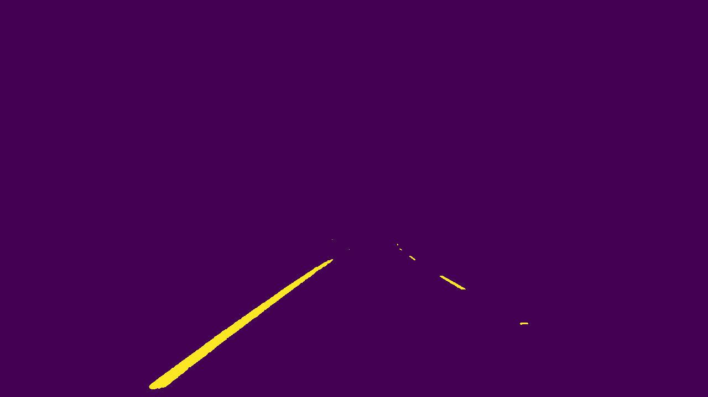

# Advanced Lane Lines (Term 1)

## Objective
The goal of this project is to expand on the first project of this term and apply more advanced computer vision techniques to the problem of finding lane markings.

## Approach
We first use the provided calibration images (containing images of a `9x6` chess-board) to compute the distortion coefficients of the camera. These can then be used to undistort all the images that were taken with this camera. After this, we extract the HLS decomposition of each image, and apply histogram equalization on the L channel. We use thresholding on the S channel, as well as on the Sobel gradients of the equalized L channel, to extract coarse lane markings from the image.
Afterwards, we do a perspective transform on the image to obtain a birds-eye view of the lanes, and use RANSAC to interpolate both lines. At this point, we color the region between the interpolated lines, and revert back to the original image frame (undoing the perspective transform). Finally, this is overlayed on top of the original image.

## Camera calibration
The images in the folder `camera_cal` were used to compute the distortion coefficients of the camera.
As an example, here is a distorted image taken with the camera:

After undistortion, here is the corresponding image:

The distortion coefficients were computed using `cv2.calibrateCamera`, whilst the chessboard was detected with `cv2.findChessboardCorners`.
Here is an example of an undistorted image taken on the road:

## Lane point detection
As mentioned above, the S-channel of the HLS image decomposition and the Sobel gradients of the L-channel of the same decomposition were used in order to detect the lane markings.
Before applying Sobel gradients, the L channel was histogram-equalized. The Sobel gradients were thresholded by requiring that their magnitude be at least `80`, and by requiring that the arc-tangent of the ratio between the absolute `y` and absolute `x` gradients be between `0` and `65`. The S-channel was thresholded to be at least `180`.
A region of interest was applied, consisting of a the difference between two trapezoids (the content of the inner trapezoid was discarded).
For the same image as above, here is what the thresholded Sobel gradients look like:

Moreover, here is what the thresholded S-channel looks like:

And their superposition:

## Perspective transform
At this point, a perspective transform was applied to the thresholded binary image.
This was done through `cv2.getPerspectiveTransform` (to determine the transformation based on `4` input-output coordinate pairs, which suffice to determine the required transformation); to apply the computed transformation, we used `cv2.warpPerspective`. Here is an example of a birds-eye view of the road:

## Lane marking extraction from birds eye
At this point, we deviated from the suggestion of the instructors, and instead implemented a RANSAC-like approach to finding the lanes from the birds-eye view of the road.
RANSAC consists of iteratively applying polynomial interpolation, and disregarding the points whose distance from the previous interpolated line exceeds a certain parameter.
Here is an example of the RANSAC results:

## Inverse transform and overlay
After applying RANSAC, we color the region between the extrapolated lanes, apply the inverse perspective transform.
Here is what this looks like before applying the inverse perspective transform:

After applying the inverse perspective transform, we get:

Note that the inverse perspective transform is computed with `np.linalg.inv`.

## Conclusion

examples

[here](https://youtu.be/pi8hGzjxwAE)
