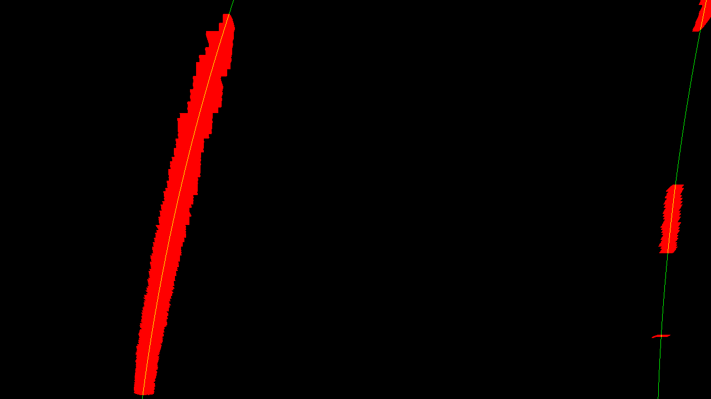

# Advanced Lane Lines (Term 1)

## Objective
The goal of this project is to expand on the first project of this term and apply more advanced computer vision techniques to the problem of finding lane markings.

## Approach
We first use the provided calibration images (containing images of a `9x6` chess-board) to compute the distortion coefficients of the camera. These can then be used to undistort all the images that were taken with this camera. After this, we applied thresholding on a number of different channels (B-channel of LAB, and L- and V-channels of LUV) in order to extract coarse lane markings from the image. We also tested using the Sobel gradients of the equalized L channel, but their use introduced unnecessary noise and was dismissed. The use of the S-channel of HLS was also dismissed for similar reasons.
Afterwards, we do a perspective transform on the image to obtain a birds-eye view of the lanes, and use RANSAC to interpolate both lines. At this point, we color the region between the interpolated lines, and revert back to the original image frame (undoing the perspective transform). Finally, this is overlayed on top of the original image.

## Camera calibration
The images in the folder `camera_cal` were used to compute the distortion coefficients of the camera.
As an example, here is a distorted image taken with the camera:

After undistortion, here is the corresponding image:

The distortion coefficients were computed using `cv2.calibrateCamera`, whilst the chessboard was detected with `cv2.findChessboardCorners`.
Here is an example of an undistorted image taken on the road:

## Lane point detection
Lane point detection was done by essentially extracting the LAB and LUV decompositions of the undistorted image, and applying thresholding to each of these individually. The thresholded images were then combined.
A region of interest was applied, consisting of a the difference between two trapezoids (the content of the inner trapezoid was discarded).
Here is what the output looks like:

## Perspective transform
At this point, a perspective transform was applied to the thresholded binary image.
This was done through `cv2.getPerspectiveTransform` (to determine the transformation based on `4` input-output coordinate pairs, which suffice to determine the required transformation); to apply the computed transformation, we used `cv2.warpPerspective`. Here is an example of a birds-eye view of the road:

## Lane marking extraction from birds eye
At this point, we deviated from the suggestion of the instructors, and instead implemented a RANSAC-like approach to finding the lanes from the birds-eye view of the road.
RANSAC consists of iteratively applying polynomial interpolation, and disregarding the points whose distance from the previous interpolated line exceeds a certain parameter.
Here is an example of the RANSAC results:

## Inverse transform and overlay
After applying RANSAC, we color the region between the extrapolated lanes, apply the inverse perspective transform.
Here is what this looks like before applying the inverse perspective transform:

After applying the inverse perspective transform, we get:

Note that the inverse perspective transform is computed with `np.linalg.inv`.
Finally, we overlay this on top of the initial undistorted image:

## Radius of curvature and distance from the center
The radius of curvature was computed using the formula provided, by applying RANSAC on the re-normalized points in the birds-eye view.
To compute the distance from the center, we evaluated the polynomials interpolating the lane lines at the maximum value of `y`, and see how their average differs from half of the image width.
This value was then divided by the image width and multiplied by the average lane width in US highlanes (3.7 meters), multiplied by the ratio between the image width and the distance between the interpolated polynomials at the maximum value of `y`. The images above already include the values of radius of curvature and distance from the lane center.

## Video processing
Similarly to what had been done in the first project, we used `moviepy.editor.VideoFileClip` to open the source video, and the `fl_image` to process each frame; `write_videofile` was used to write the resulting video. The produced video can be found in `project_mp4_out.mp4`.

## Critique
Many of the techniques in use here are not particularly robust. It's quite hard to pick the relevant thresholds in a way that results in a good performance across the entire video. The RANSAC algorithm, although a good way of dealing with the noisy points that do not belong to the right lane lines, at times fails to provide satisfactory results. This typically happens when few lane markings are detected, and lots of false positives show up in the thresholded binary image. Removing the
use of Sobel gradients helped with this issue, and was compensated by looking at a wider source of color channels.
